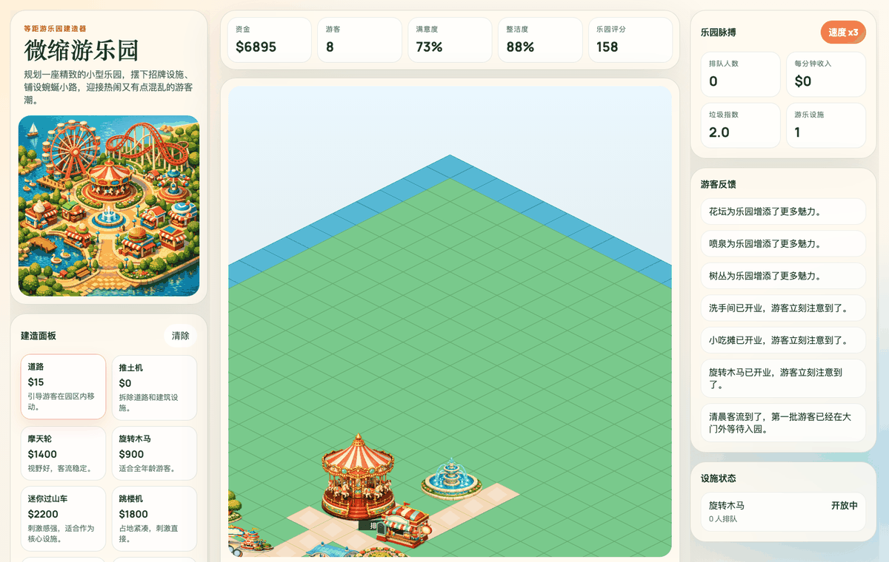

# Theme Park Builder Clone

A static recreation of the OpenAI Showcase "Theme Park Builder" mini-game.

## Gameplay Preview



## Run

Use any static file server from the project root. For example:

```bash
python3 -m http.server 8000
```

Then open `http://localhost:8000`.
